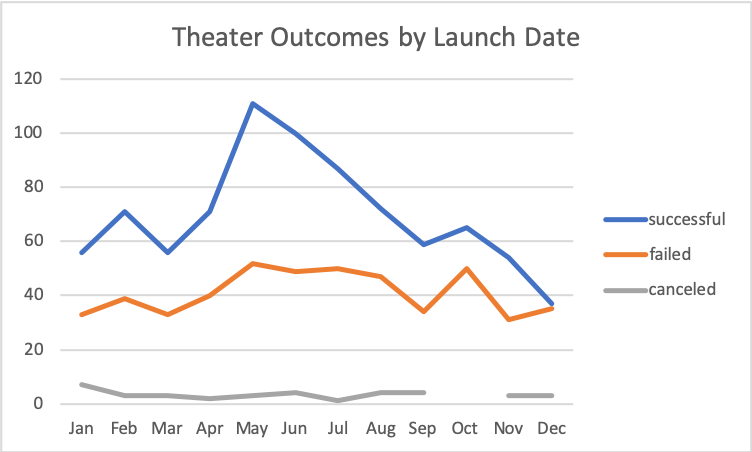
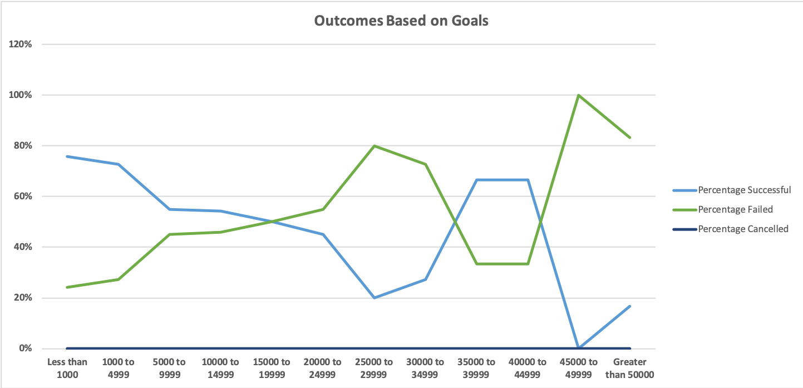
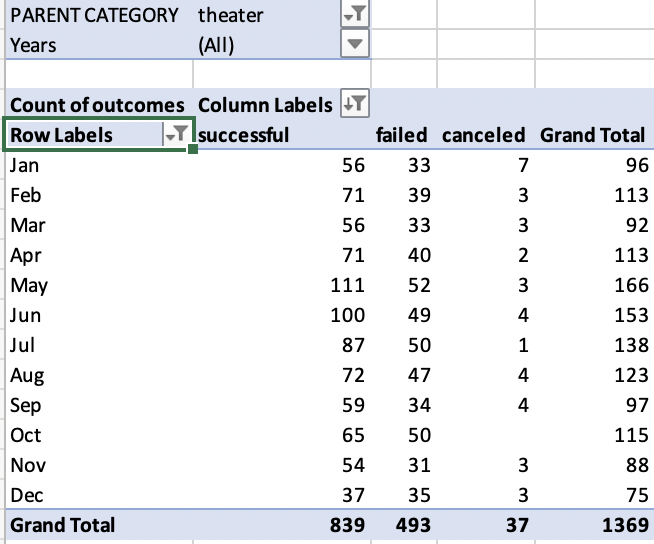

# An Analysis of Kickstarter campaigns

## Overview of Project 
The purpose of this project is to give Louisa insight into how some campaigns did in relation to their launch dates and their funding goals. 

## Analysis and Challenges 
  - The analysis includes a look into the number of theater campaigns that were successful, failed, and canceled based on the months they were launched. As seen in the graph, there was an upward trend for successful campaigns launched at the beginning of the year with a spike in May, and then a downward trend for the rest of the year.

  - The analysis also includes the percentage successful, failed, and cancelled outcomes based on goals for campaigns in the subcategory of "plays". As seen in the chart below, there was an increase in percentage failed and a decrease in percentage successful as the Outcome goal for campaigns increased from 1000 to about 30,000. There were also no canceled campaigns for plays recorded. 

  - A challenge faced was creating a filter for "Years" in the pivot table because the dates in the data source were in mm/dd/yyyy format. However, a google search on how to use the YEAR() function to create a new column with just the years, quickly solved this problem. 
 

## Conclusion
  - The most successful theater campaigns were launched between February and May. Louisa should consider launching campaigns within that timeframe, and especially in May where they performed best. 
  - Out of a total of 1369 theater campaigns, 839 were successful which brings Louisa to a 61% success rate in theater campaigns. 
  
  
  
  - Based on the analysis done on the outcomes based on goals, campaigns with goals between 1000 and 50000, as well as those between 35000 and 50000 performed the best. Louisa couldd revisit the details of those campaigns and identify trends that could be responsible for their higher success rates.
  - Some limitations to the dataset include the original format of the Deadline and Launched_at columns which were in Unix timestamps, which required the use of a timestamp converter tool outside of excel to change the format. However, once the dates were converted, they became easily readable.
  - While some campaigns did not reach their goal, others surpassed theirs. Louisa could create an additional table showing the differences between the pledged amounts and goals, to determine what extra funds she accumulated. 
  

